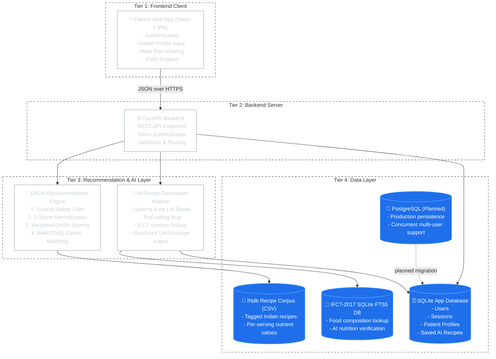

# Nourish

Nourish is a clinical nutrition recommendation prototype for hypertension management that adapts the DASH diet to Indian food composition data. The system combines a React/Vite patient application, a FastAPI backend, a DASH-based recommendation engine, and an AI-assisted recipe generation module grounded in IFCT-2017 nutritional lookup.

## System Architecture

<b>Figure: System architecture of Nourish.</b>

## Workflow Overview

1. The patient logs in and submits clinical profile information such as age, sex, weight, height, activity level, blood pressure stage, and dietary preference.
2. The FastAPI backend validates the request and retrieves the patient profile from the application database.
3. The recommendation engine loads the tagged Indian recipe corpus and removes meals exceeding the sodium safety threshold.
4. Remaining recipes are normalized and assigned weighted DASH scores.
5. Caloric needs are computed using the Mifflin-St Jeor equation with activity and population-specific adjustment.
6. A meal exchange plan is generated across breakfast, lunch, dinner, and snacks.
7. Optionally, the AI recipe module can generate structured DASH-friendly recipes grounded in IFCT-2017 nutritional lookup.
8. The resulting plan is returned to the frontend for patient viewing.

## Current Implementation

- Frontend: React, Vite, TypeScript, Material UI, PWA support
- Backend: FastAPI, Python 3.13
- Recommendation engine: pandas, NumPy, scikit-learn
- App persistence: SQLite with SQLAlchemy ORM
- Nutrition corpus: tagged INdb CSV
- AI nutrition grounding: IFCT-2017 SQLite FTS5 database
- Planned production database: PostgreSQL

## Planned Extensions

- Natural language dietary logging using the existing LLM + tool-calling pipeline
- Clinician dashboard with dietician override workflow
- Wearable integration for blood pressure feedback loops
- PostgreSQL migration for production-scale deployment
- Multilingual and voice-based dietary logging
