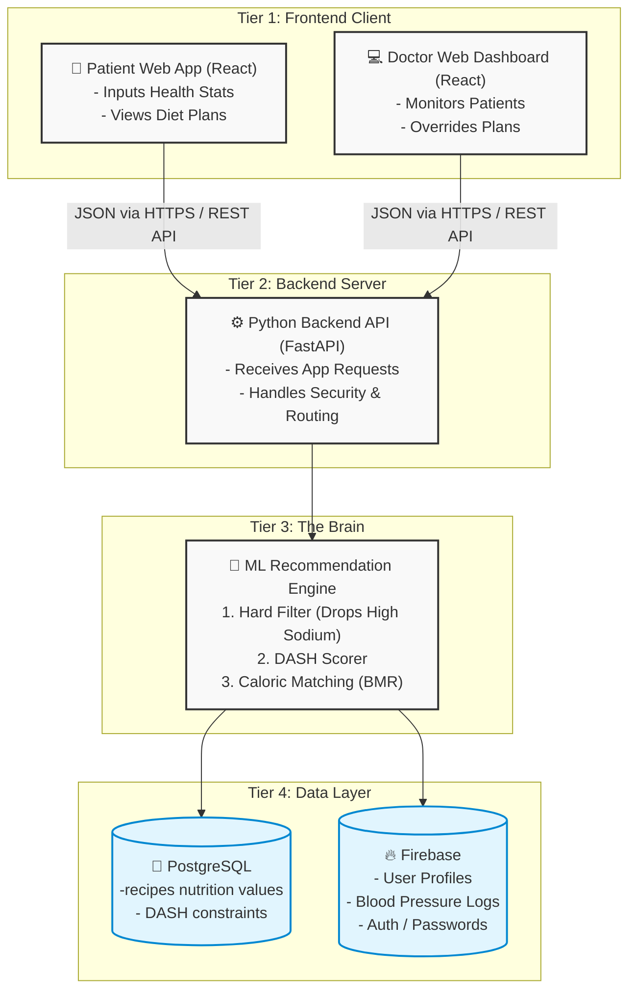

# Nourish

🏗️ System Architecture & Workflow

```mermaid
graph TD
    subgraph "Tier 1: Frontend Client"
        Patient["📱 Patient Web App (React)<br/>- Inputs Health Stats<br/>- Views Diet Plans"]
        Doctor["💻 Doctor Web Dashboard (React)<br/>- Monitors Patients<br/>- Overrides Plans"]
    end

    subgraph "Tier 2: Backend Server"
        API["⚙️ Python Backend API (FastAPI)<br/>- Receives App Requests<br/>- Handles Security & Routing"]
    end

    subgraph "Tier 3: The Brain"
        ML["🧠 ML Recommendation Engine<br/>1. Hard Filter (Drops High Sodium)<br/>2. DASH Scorer<br/>3. Caloric Matching (BMR)"]
    end

    subgraph "Tier 4: Data Layer"
        PG[("🐘 PostgreSQL<br/>-recipes nutrition values<br/>- DASH constraints")]
        FB[("🔥 Firebase<br/>- User Profiles<br/>- Blood Pressure Logs<br/>- Auth / Passwords")]
    end

    %% Connections
    Patient -- "JSON via HTTPS / REST API" --> API
    Doctor -- "JSON via HTTPS / REST API" --> API
    API --> ML
    ML --> PG
    ML --> FB
    
    %% Styling
    classDef default fill:#f9f9f9,stroke:#333,stroke-width:2px;
    classDef db fill:#e1f5fe,stroke:#0288d1,stroke-width:2px;
    class PG,FB db;
```